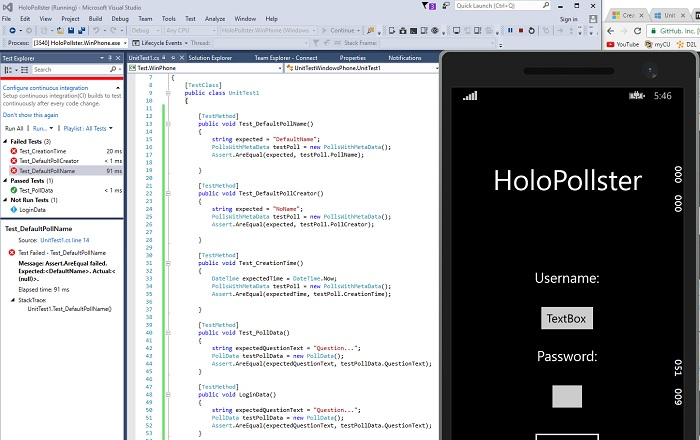

TESTING.md
CSCI3308-HoloPop  
University of Colorado:  
CSCI3308 Group Project  

## Who:  
Roy De Jesus  
Tarah Peltz  
McKenzie Weller  
Sumeet Batra  
Kristin Robinson  

## Title of project:  
HoloPop 

## Vision Statement:  
Our vision is to supply our users with a fun short gaming experience utilizing each user's immediate enviroment. We will also help companies seeking survey info by creating an incentive system for individuals to participate. Companies have the freedom to create surveys to suit their needs and users are encouraged to take them in order to unlock more games.

## Automated Tests:  
**HoloPollster**  
For the HoloPollster app we are using Visual Studios Test Explorer to create automated unit tests

## User Acceptance Tests:  

### UAT 1: Verify login with valid user name and password 
**Description**  
Test the HoloPollster welcome/login screen  

**Pre-conditions**  
User has valid user name and password  

**Test steps**  
1. Start App  
2. Type username in “Username:” text box.  
3. Type password in “Password:” text box.  
4. Click login button  

**Expected result**  
User should be able to login with valid username and password  
User should not be able to login without valid username and password  
User is navigated to the user’s home screen  

**Actual result**  
User is navigated to a user home screen regardless of entering valid or invalid username and or valid/invalid password  

**Status (Pass/Fail)**  
Fail 

**Notes**   
As above, user can login with any name or password.  
When user hits return in the keyboard, nothing happens. User must click in app to close keyboard and move to next text field 

**Post-conditions**   
User is validated with database and successfully signed into their account.  
The account session details are logged.  

### UAT 2: Verify poll creation  
**Description**  
Test make a poll functionality 

**Pre-conditions**  
User has valid user name and password  

**Test steps**   
1. Select “Make a Poll” from the user home screen.  
2. Select “Add a question.”  
3. Type in question text in “Your Question Here” text box.  
4. Select “Add a question.”  
5. Click on toggle next to “Radio Buttons” text.  
6. Type in question in “Your Question Here” text box.  
7. Select “Create Quiz”.  
8. Type in name in “Your Name Here” text box.  
9. Click on “Submit” button.  
10. Click on “Take a Poll”.  
11. Click on your name in list.  
12. Verify that the poll appears.  

**Expected result**  
User enters as many questions as they like, submits quiz and the quiz is then available to take. All the questions the user created appear and the questions have the correct answer options (buttons or text fields).  

**Actual result**   
User can create poll create poll and add at least 10 questions. Poll appears when the user selects “Take a Poll”.  
Radio buttons do not appear (all questions are open text).  
Question text does not appear. Generic “Question” followed by a number appears (ex. “Question 4”).  

**Status (Pass/Fail)**   
Fail  

**Notes**   
Keyboard does not disappear when user hits return. User must click on screen to submit text. 
Text box for “Your Name Here” changes size relative to text input (box gets smaller when text is deleted, box expands as text is added).
Radio buttons do not appear. 

**Post-conditions**   
Poll created and saved in database.  

### UAT 3: Verify poll works  
**Description**  
Test that the user can take a poll that has already been created  

**Pre-conditions**  
At least one poll has been created

**Test steps**  
1. Select “Take a Poll” from the user home screen.  
2. Select one of the polls listed.  
3. Enter answers to poll questions.  
4. Select “Submit”  
5. Select “My Statistics”  
6. Verify poll results appear  

**Expected result**  
User can answer all questions and enter submit and the poll results will be collected.  

**Actual result**  
User is navigated to poll. As in Verify Poll creation test results, poll questions do not appear. User’s data is not stored.

**Status (Pass/Fail)**  
Fail

**Notes**  
Assume results are not being stored. When you go to “My Statistics” nothing happens. 

**Post-conditions**  
Poll results are successfully stored in database.
