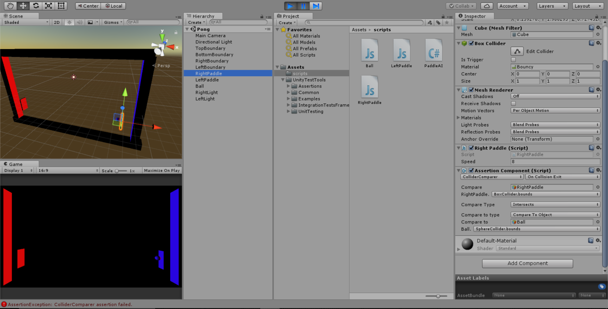
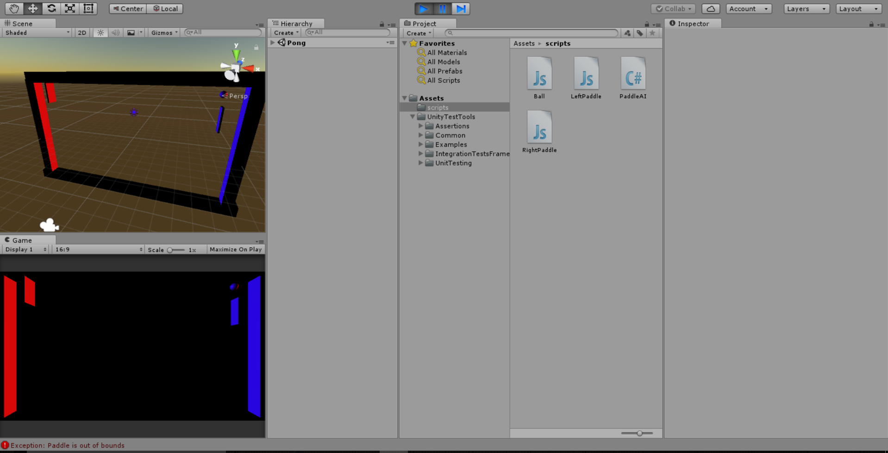
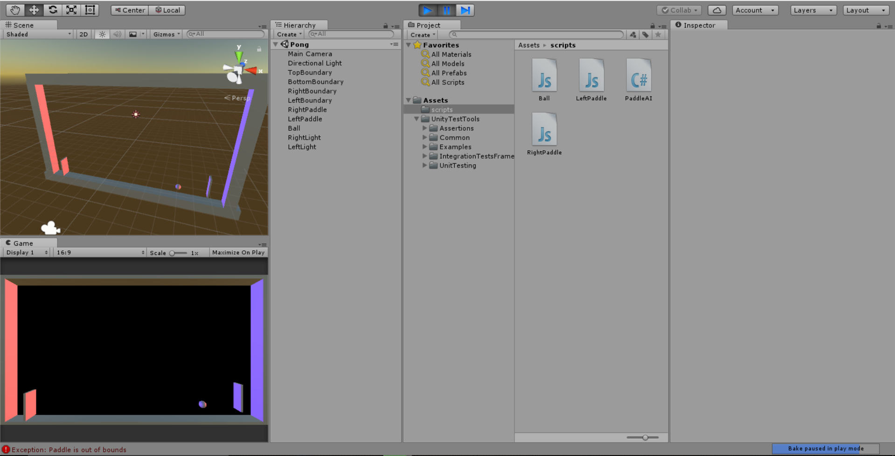

TESTING.md
CSCI3308-HoloPop  
University of Colorado:  
CSCI3308 Group Project  

## Who:  
Roy De Jesus  
Tarah Peltz  
McKenzie Weller  
Sumeet Batra  
Kristin Robinson  

## Title of project:  
HoloPop 

## Vision Statement:  
Our vision is to supply our users with a fun short gaming experience utilizing each user's immediate enviroment. We will also help companies seeking survey info by creating an incentive system for individuals to participate. Companies have the freedom to create surveys to suit their needs and users are encouraged to take them in order to unlock more games.

## Automated Tests:  
**HoloPollster**  
For the HoloPollster app we are using Visual Studio Test Explorer to create automated unit tests

**3DPong - Unity**
For Unity games testing, we use the **Unity Test Tools**, which can be found in the asset store, as well as the assertion library for testing c# scripts.
https://www.assetstore.unity3d.com/en/#!/content/13802

In this picture, **Unity Test Tools** is being used to assert whether the ball has collided with the right paddle, and is about to leave the point of contact. This test has helped with physics debugging between the ball and paddle's rigid bodies. As expected, the assertion fails once the ball collides. 

Here, a custom-made assertion script pauses the game and throws an exception when the left paddle leaves the bounds of the game. This test assists in debugging errors with the left paddle leaving the boundaries.

## User Acceptance Tests:  

Note: This app is stored on GitHub here: https://github.com/Tarah-Peltz/Polling-App-Cross-Plat.git

### UAT 1: Verify login with valid user name and password 
**Description**  
Test the HoloPollster welcome/login screen  

**Pre-conditions**  
User has valid user name and password  

**Test steps**  
1. Start App  
2. Type username in “Username:” text box.  
3. Type password in “Password:” text box.  
4. Click login button  

**Expected result**  
User should be able to login with valid username and password  
User should not be able to login without valid username and password  
User is navigated to the user’s home screen  

**Actual result**  
User is navigated to a user home screen regardless of entering valid or invalid username and or valid/invalid password  
**Status (Pass/Fail)**  
Fail 

**Notes**   
As above, user can login with any name or password.  
When user hits return in the keyboard, nothing happens. User must click in app to close keyboard and move to next text field 

**Post-conditions**   
User is validated with database and successfully signed into their account.  
The account session details are logged in database.  

### UAT 2: Verify poll creation  
**Description**  
Test make a poll functionality 

**Pre-conditions**  
User has valid user name and password  

**Test steps**   
1. Select “Make a Poll” from the user home screen.  
2. Select “Add a question.”  
3. Type in question text in “Your Question Here” text box.  
4. Select “Add a question.”  
5. Click on toggle next to “Radio Buttons” text.  
6. Type in question in “Your Question Here” text box.  
7. Select “Create Quiz”.  
8. Type in name in “Your Name Here” text box.  
9. Click on “Submit” button.  
10. Click on “Take a Poll”.  
11. Click on your name in list.  
12. Verify that the poll appears.  

**Expected result**  
User enters as many questions as they like, submits quiz and the quiz is then available to take. All the questions the user created appear and the questions have the correct answer options (buttons or text fields).  

**Actual result**   
User can create poll create poll and add at least 10 questions. Poll appears when the user selects “Take a Poll”.  
Radio buttons do not appear (all questions are open text).  

**Status (Pass/Fail)**   
Pass  

**Notes**   
Keyboard does not disappear when user hits return. User must click on screen to submit text. 
Text box for “Your Name Here” changes size relative to text input (box gets smaller when text is deleted, box expands as text is added).
Radio buttons do not appear. 

**Post-conditions**   
Poll created and saved in database.  

### UAT 3: Verify poll works  
**Description**  
Test that the user can take a poll that has already been created  

**Pre-conditions**  
At least one poll has been created

**Test steps**  
1. Select “Take a Poll” from the user home screen.  
2. Select one of the polls listed.  
3. Enter answers to poll questions.  
4. Select “Submit”  
5. Select “My Statistics”  
6. Verify poll results appear  

**Expected result**  
User can answer all questions and enter submit and the poll results will be collected.  

**Actual result**  
User is navigated to poll. Questions are displayed and user is able to type answers to questions. However, "My Statistics" button does nothing.

**Status (Pass/Fail)**  
Fail

**Notes**  
Assume results are not being stored. When you go to “My Statistics” nothing happens. 

**Post-conditions**  
Poll results are successfully stored in database.

### UAT 4: Take polls with duplicate names
**Description**  
Test that the user can successfully take polls even when duplicate poll names are used

**Pre-conditions**  
At least two polls with the same names but different questions have been created

**Test steps**  
1. Select “Take a Poll” from the user home screen.  
2. Select one of the polls with the same name
3. Enter answers to poll questions.  
4. Select “Submit”  
5. Select the other poll with the same name
6. Verify the polls display different questions

**Expected result**  
User can take both polls successfully. The appropriate questions are displayed in the case of a duplicated name

**Actual result**  
The questions correlated with the second poll are always the questions displayed

**Status (Pass/Fail)**  
Fail

**Notes**  
The app is not differentiating between polls. Other unique factors must be used to fetch poll questions 

**Post-conditions**  
Polls display the correct questions every time, regardless of duplicated names.

### UAT 5: Control the ball to collect cubes
**Description**  
Test that the user can control the ball in Roll-a-Ball to collect cubes

**Pre-conditions**  
User has PC, can run a .exe application

**Test steps**  
1. Run RollerBall_PC.exe  
2. Use the arrow keys to roll the ball
3. Roll the ball into the cubes to "collect" them  

**Expected result**  
User can move the ball with arrow keys. When the ball is rolled into a cube, the cube disappears. 

**Actual result**  
The ball rolls with arrow keys. Cubes disappear upon contact with the ball. A count of collected subes is displayed in the top left.

**Status (Pass/Fail)**  
Pass

**Notes**  
Physics could be improved. Ball gains momentum easily - sticky to control. 

**Post-conditions**  
User collects all the subes to end the game.

### UAT 6: Shoot the cue ball
**Description**  
Test that the user can shoot the cue ball in the pool game

**Pre-conditions**  
User can run a .exe application

**Test steps**  
1. Run UnityPoolCU.exe  
2. Use the arrow keys to aim the direction of the cue ball
3. Hold the left mouse button to "pull back" the cue stick
4. Release the left mouse button to "hit" the cue ball

**Expected result**  
User can aim the cue ball and apply a "force" with the cue stick depending on how long the left mouse button is held down.

**Actual result**  
The screen is rotated with the arrow keys to "aim" the ball. Pressing the mouse button simulates pulling back the cue stick. Cue ball moves with different velocity depending on how long the button is pressed.

**Status (Pass/Fail)**  
Pass

**Notes**  
Physics could be improved. There is a fine line between the cue ball not moving at all and moving ridiculously fast. There should be a way to cancel if the user wishes to change aim, etc.

**Post-conditions**  
The cue ball is launched forward and interacts with the rest of the table.

### UAT 7: Knock a ball into the pockets
**Description**  
Test that the user can knock other balls into the pockets with the cue ball in the pool game

**Pre-conditions**  
User can run a .exe application

**Test steps**  
1. Run UnityPoolCU.exe  
2. Use the arrow keys to aim the direction of the cue ball
3. Hold the left mouse button to "pull back" the cue stick
4. Release the left mouse button to "hit" the cue ball toward other balls
5. Hit the balls toward the pockets
6. The balls will sink if they collide with the pockets and disappear, gaining a score

**Expected result**  
User can gain points and make other balls disappear by knocking them into the pockets using the cue ball.

**Actual result**  
The other balls will typically sink when colliding with the pockets. They can get stuck, occasionally, and the game will bug.

**Status (Pass/Fail)**  
A bit of both?

**Notes**  
Physics could be improved. There is no scoring based on what color ball is sunk. Player who gains points switches often.

**Post-conditions**  
The game ends when all six balls have been "sunk".
